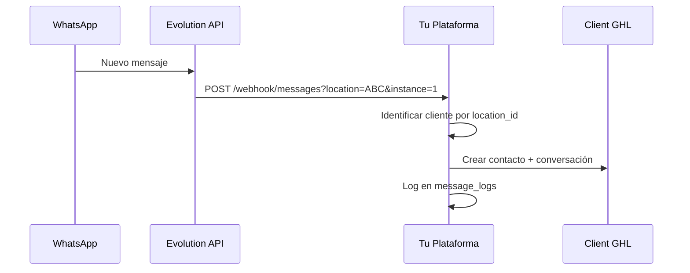

# 🎯 PLATAFORMA MULTI-TENANT WHATSAPP-GOHIGHLEVEL

Plataforma SaaS que permite a múltiples clientes conectar hasta 5 instancias de WhatsApp Business a sus respectivas cuentas de GoHighLevel.

## ✨ Características

- 🏢 **Multi-tenant**: Cada cliente gestiona sus propias instancias
- 📱 **5 WhatsApp por cliente**: Plan básico incluye 5 conexiones
- 🔗 **Integración GHL**: Automática vía OAuth cuando instalan tu app
- ⚡ **QR Dinámicos**: Generación automática de códigos QR
- 🔄 **Tiempo Real**: WebSockets para actualizaciones instantáneas
- 📊 **Estadísticas**: Dashboard con métricas por cliente
- 🎨 **UI Elegante**: Interfaz estilo Ram Mega Autos

## 🏗️ Arquitectura

```
┌─────────────────┐    ┌──────────────────┐    ┌─────────────────┐
│   GHL Client    │───▶│  Tu Plataforma   │───▶│  Evolution API  │
│   Instala App   │    │   Multi-tenant   │    │  WhatsApp Mgr   │
└─────────────────┘    └──────────────────┘    └─────────────────┘
                                │
                                ▼
                       ┌─────────────────┐
                       │   PostgreSQL    │
                       │   Multi-tenant  │
                       └─────────────────┘
```

## 🚀 Instalación Rápida

### 1. Clonar y configurar

```bash
# Instalar dependencias
npm install

# Crear archivo de configuración
cp env-example.txt .env
# Editar .env con tus valores reales
```

### 2. Base de Datos

```bash
# Crear base de datos MySQL/PostgreSQL
mysql -u root -p -e "CREATE DATABASE whatsapp_ghl_platform;"

# Ejecutar schema
mysql -u root -p whatsapp_ghl_platform < database/schema.sql
```

### 3. Configurar Evolution API

Asegúrate de que tienes Evolution API funcionando:

```env
EVOLUTION_API_URL=https://evolutionv2.cloude.es
EVOLUTION_API_KEY=tu-api-key
```

### 4. Iniciar servidor

```bash
# Modo desarrollo
npm run dev

# Modo producción
npm start
```

## 🔧 Configuración GoHighLevel App

### 1. Crear App en GHL Marketplace

1. Ve a: https://marketplace.gohighlevel.com/
2. Crear nueva app
3. Configurar OAuth:
   - **Redirect URI**: `https://tu-dominio.com/api/ghl/callback`
   - **Scopes**: `contacts.write`, `conversations.write`, `locations.read`

### 2. Webhook de Instalación

Configura webhook cuando instalen tu app:
```
POST https://tu-dominio.com/api/ghl/install
```

Payload esperado:
```json
{
  "locationId": "abc123",
  "companyName": "Mi Empresa",
  "accessToken": "token...",
  "refreshToken": "refresh...",
  "scopes": ["contacts.write", "conversations.write"]
}
```

## 📱 Flujo del Usuario

### 1. Cliente instala tu App GHL
```
Cliente en GHL Marketplace → Instala tu app → Webhook a tu servidor
```

### 2. Cliente se registra en tu plataforma
```
https://tu-dominio.com/register
- Location ID (automático desde GHL)
- Nombre, Email, Teléfono
```

### 3. Cliente usa el dashboard
```
https://tu-dominio.com/dashboard
- Ve 5 slots de WhatsApp
- Activa instancias (genera QR)
- Escanea QR con WhatsApp
- Mensajes van automáticamente a su GHL
```

## 🎨 Dashboard UI

Dashboard inspirado en Ram Mega Autos con 5 slots:

```
╔══════════════════════════════════════╗
║              Mi Empresa              ║
║       Location: ABC123456789         ║
╠══════════════════════════════════════╣
║ asesor1 (1)    [+18099939042    ] ✅ ║
║ asesor2 (2)    [Not Connected  ] ❌ ║
║ asesor3 (3)    [Not Connected  ] ❌ ║
║ asesor4 (4)    [Not Connected  ] ❌ ║
║ asesor5 (5)    [Not Connected  ] ❌ ║
╠══════════════════════════════════════╣
║              [Settings]              ║
╚══════════════════════════════════════╝
```

## 🔌 API Endpoints

### Autenticación
- `POST /api/ghl/install` - Webhook instalación GHL
- `POST /api/clients/register` - Registro de cliente  
- `POST /api/clients/login` - Login por location_id

### Instancias WhatsApp
- `GET /api/instances/:locationId` - Obtener instancias del cliente
- `POST /api/instances/:locationId/activate` - Activar instancia (generar QR)
- `POST /api/instances/:locationId/disconnect` - Desconectar instancia

### Webhook Evolution
- `POST /api/webhook/messages?location=ABC&instance=1` - Webhook único con variables

### Estadísticas  
- `GET /api/statistics/:locationId/today` - Estadísticas del día
- `GET /api/statistics/:locationId/history/:days` - Histórico

## 📊 Base de Datos

### Tablas principales:

- **ghl_installations**: Instalaciones de la app GHL
- **clients**: Clientes registrados en tu plataforma  
- **whatsapp_instances**: Instancias WhatsApp (5 por cliente)
- **message_logs**: Historial de mensajes procesados
- **client_statistics**: Estadísticas por cliente
- **webhook_logs**: Logs de webhooks para debugging

## 🔄 Webhook Flow



## 🚦 Estados de Instancia

- `inactive`: Slot vacío, listo para activar
- `qr_pending`: QR generado, esperando escaneo  
- `connected`: WhatsApp conectado y funcionando
- `disconnected`: Desconectado (puede reactivarse)

## 🎯 Modelo de Negocio

### Plan Básico (por cliente):
- 5 instancias WhatsApp incluidas
- Dashboard completo
- Estadísticas básicas
- Soporte por email

### Plan Premium (futuro):
- 10 instancias WhatsApp
- API avanzada
- Webhooks personalizados  
- Soporte prioritario

## 🚀 Deployment

### Usando Docker

```bash
# Construir imagen
docker build -t whatsapp-ghl-platform .

# Ejecutar con docker-compose
docker-compose up -d
```

### En VPS Manual

```bash
# Instalar dependencias del sistema
sudo apt update
sudo apt install nodejs npm mysql-server nginx

# Clonar repositorio
git clone tu-repo.git
cd whatsapp-ghl-platform

# Instalar y configurar
npm install
npm run build
pm2 start server-multitenant.js

# Configurar nginx como proxy reverso
# Configurar SSL con Let's Encrypt
```

## 🔐 Seguridad

- ✅ Validación de Location ID en cada request
- ✅ Webhooks firmados con secret
- ✅ Rate limiting por cliente
- ✅ Logs completos de actividad
- ✅ Encriptación de tokens sensibles

## 📈 Monitoring

### Health Checks
```bash
curl https://tu-dominio.com/health
curl https://tu-dominio.com/metrics
```

### Logs Importantes
```bash
# Ver logs en tiempo real
tail -f logs/app.log

# Filtrar por cliente específico
grep "location_ABC123" logs/app.log
```

## 🐛 Troubleshooting

### QR no se genera
1. Verificar conexión Evolution API
2. Verificar API key válida
3. Revisar logs: `grep "createInstance" logs/app.log`

### Mensajes no llegan a GHL
1. Verificar webhook configurado correctamente
2. Verificar tokens GHL del cliente válidos
3. Revisar logs: `grep "processEvolutionWebhook" logs/app.log`

### Cliente no puede hacer login
1. Verificar que instaló la app GHL
2. Verificar registro en tabla `clients`
3. Verificar Location ID correcto

## 🤝 Soporte

- **Documentación**: Este README
- **Issues**: GitHub Issues  
- **Email**: soporte@tu-dominio.com
- **Discord**: Tu servidor Discord

## 🔄 Updates y Releases

### v1.0.0 - MVP
- ✅ Multi-tenant básico
- ✅ 5 instancias por cliente  
- ✅ Dashboard funcional
- ✅ Integración Evolution + GHL

### v1.1.0 - Mejoras (próximo)
- 🔄 Pagos con Stripe
- 🔄 Panel de administración
- 🔄 API para desarrolladores
- 🔄 Respuestas automáticas con IA

---

## 🚀 ¡Listo para usar!

1. Instala las dependencias
2. Configura el `.env`  
3. Crea la base de datos
4. Inicia el servidor
5. Configura tu app GHL
6. ¡Empieza a recibir clientes!

**¡Tu plataforma SaaS multi-tenant está lista para escalar! 🚀**